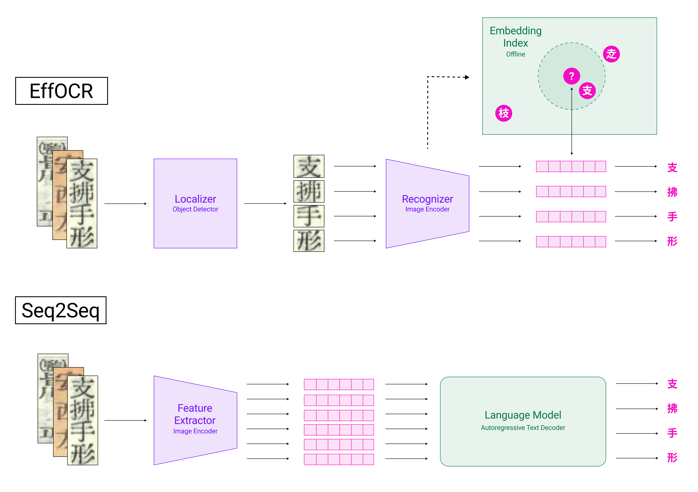

# EffOCR

This repository contains the official implementation of [EffOCR](https://arxiv.org/abs/2304.02737). EffOCR is an OCR architecture that emphasizes sample (and computational) efficiency without compromising on accuracy! EffOCR accomplishes this by treating text recognition not as a sequence/language modeling task, but as a metric learning/image retrieval task.



EffOCR is comprised of two modules, trained separately: 
- a **localizer**, an object detector that is fine-tuned for the purpose of detecting characters/letters/glyphs/words in an image of text; and 
- a **recognizer**, which classifies/assigns identities to localized glyphs.

In this repo, we provide tools for training your own EffOCR models for your particular documents of interest, as well as for running fast and accurate inference on new samples.

## Installation

Clone this repo, then install [requirements.txt](requirements.txt) in an environment with `Python >= 3.7`. (To accommodate downloading GPU-compatible FAISS, as referenced below, it can be useful to first set up and activate a [conda](https://docs.anaconda.com/anaconda/install/index.html) environment before installing these required dependencies.)

```bash
git clone git@github.com:dell-research-harvard/effocr.git
cd effocr
pip install -r requirements.txt
```

Separately, you'll also need to install 

- both
    - [FAISS](https://github.com/facebookresearch/faiss/blob/main/INSTALL.md) and
    - [PyTorch](https://pytorch.org/get-started/locally/)
- as well as either
    - [Detectron2](https://github.com/facebookresearch/detectron2/blob/main/INSTALL.md) or
    - [MMDetection](https://github.com/open-mmlab/mmdetection/blob/master/docs/en/get_started.md/#Installation) or
    - [YOLOv5](https://github.com/ultralytics/yolov5#documentation)

as is appropriate for your use case.

## Dataset Formatting

For the purposes of training and evaluating EffOCR localizers and recognizers, we require that your dataset of interest is transcribed into the [COCO format](https://www.immersivelimit.com/tutorials/create-coco-annotations-from-scratch) with annotations at the character level, and with image level text fields that denote the transcription of the text line image, e.g., 

```
...
  "images": [
    {
      "id": 13,
      "width": 958,
      "height": 46,
      "file_name": "194906.png",
      "text": "they arrived overland from San Fran-"
    },
...
```

The [scripts](scripts/) directory contains a few useful utilities for combining, splitting, and subsetting COCO-formatted JSON files.

This COCO-formatted dataset can be used directly for localizer training, and can be converted into another format suitable for recognizer training with a single script, described below.

By default, English and Japanese language datasets are supported by EffOCR. Other languages are certainly compatible with the EffOCR framework, but it might require that you fork and modify this codebase as appropriate for your application of interest.

## Logging

By default, EffOCR supports logging with [Weights & Biases](https://wandb.ai/site). We encourage you therefore to set up a W&B account and initiate a `wandb login` command before starting out on the training process.

## Training

### Localizer 

Presently, EffOCR localizer models can be trained either via the provided [train_effocr_localizer_d2.py](train_effocr_localizer_d2.py) script **or**  via the [MMDetection](https://github.com/open-mmlab/mmdetection) or [YOLOv5](https://github.com/ultralytics/yolov5) object detection libraries. We aim to provide built-in support for MMDetection and YOLOv5 localizer training in the near future. 

To use the Detectron2-backend training localizer script, a character localization dataset must first be [locally registered](https://detectron2.readthedocs.io/en/latest/tutorials/datasets.html). As one example, calling the [train_effocr_localizer_d2.py](train_effocr_localizer_d2.py) script could look like:

```bash
python ./train_effocr_localizer_d2.py \
    --name <W&B run name> \
    --config <absolute path to D2 config> \
    --dataset_name <name of Detectron2 dataset to be registered> \
    --dataset_root <absolute path to root dir for COCO formatted data> \
    --train_file <name of COCO JSON training file> \
    --val_file <name of COCO JSON val file>\
    --test_file <name of COCO JSON test file> \
    --images_dir <name dir in root with images for training, testing, validation> \
    --init_ckpt <absolute path to saved model checkpoint, if applicable> \
    --num_epochs <e.g. 100> \
    --lr <e.g. 1e-5> \
    --batch_size <e.g. 2> \
    --num-gpus <N>
```

### Recognizer

The script [format_effocr_recognizer_dataset.py](format_effocr_recognizer_dataset.py) takes in a COCO-style dataset that would be used for e.g. localizer training and outputs a dataset amenable to recognizer training, which is essentially a dataset with a file structure compatible with a slightly modified version of a PyTorch [ImageFolder](https://pytorch.org/vision/main/generated/torchvision.datasets.ImageFolder.html) dataset class. Specifically, the script creates a training dataset by combining synthetic charaters generated from a wide collection of fonts with user-provided character crops from source documents. 

```bash
python format_effocr_recognizer_dataset.py \
    --image_dir <absolute path to COCO image dir> \  
    --coco_jsons <comma-separated absolute paths to COCO JSONs, e.g., /path/to/train.json,/path/to/test.json,/path/to/val.json> \
    --crops_save_dir <absolute path for saving glyph crops, an intermediate output> \
    --cat_id <COCO category ID for cropping, e.g., 0> \                         
    --clip_to_top_and_bottom              
    --font_dir <absolute path to fonts for synthetic data mix in, e.g., ./english_font_files> \
    --charset_dir <path to character sets for rendering synthetic data, e.g., ./english_charsets> \  
    --dataset_save_dir <absolute path for saving recognizer dataset> \
    --padding <e.g. 0.05> \
    --spaces        
```

Recognizer models are trained via the [train_effocr_recognizer.py](train_effocr_recognizer.py) script. Example usage is as follows:

```bash
python ./train_effocr_recognizer.py \
    --root_dir_path <abs path to recognizer dataset, specified in dataset_save_dir above> \
    --train_ann_path <abs path to train annotations from COCO dataset> \
    --val_ann_path <abs path to val annotations from COCO dataset> \
    --test_ann_path <abs path to test annotations from COCO dataset> \
    --run_name <W&B run name for logging> \
    --auto_model_timm <timm model name (see below)> \
    --batch_size <e.g. 128> \
    --num_epochs <e.g. 60> \
    --num_passes <e.g. 1 for Japanese, 10 for English> \
    --lang <e.g., "en" for English character or "jp" for Japanese> \
    --lr <e.g. 2e-5> \
    --imsize <must be compatible with timm model input, e.g., 224> \
    --infer_hardneg_k <e.g. 8> \
    --hns_txt_path <used in a second run, or if you have already created a hns.txt file, see below>
```

To view a list of available timm models that one can use as encoders for the EffOCR recognizer, one can run:

```python
import timm
print(timm.list_models(pretrained=True))
```

We recommend many of the models used in the [EffOCR paper](https://arxiv.org/abs/2304.02737), including:
 - `mobilenetv3_small_050`
 - `convnext_tiny`
 - `xcit_small_12_p8_224`

#### Hard Negative Mining and Training

Typically, recognizer models are trained in two steps: a first training run is essentially just used to mine hard negatives and a second training run trains a model incorporating those hard negatives (N.B. this second model does not need to be fine-tuned from the model output in the first run, such that if you have already gathered info on hard negatives, you can jump right to hard negative training). Adding the `--infer_hardneg_k` argument generates a list of $k$ hard negatives (most visually similar charaters) for each character in the dataset and saves this list to a text file called `hns.txt`. Passing in the absolute path of this text file of generated hard negatives via the `--hns_txt_path` argument will utilize the enclosed hard negative information in a training run, typically increasing recognizer performance substantially.

## Inference

Text line inference is done via either the [infer_effocr.py](infer_effocr.py) or [infer_effocr_onnx_multi.py](infer_effocr_onnx_multi.py) scripts. [infer_effocr.py](infer_effocr.py) supports Detectron2- or MMDetection-backend localizers. It does _not_ currently support YOLOv5-backend localizers. 

An example call to [infer_effocr.py](infer_effocr.py) would look like:

```bash
python ./infer_effocr.py \
    --image_dir <path to text line images to be inferenced> \
    --infer_over_img_dir \
    --auto_model_timm <timm model name (same as used in recognizer training) \
    --recognizer_dir <directory with saved recognizer model as "enc_best.pth"> \
    --localizer_dir <directory with saved localizer model as "best_bbox_mAP.pth" and config as "*.yaml" or "*.py"> \
    --lang <e.g., "en" for English or "jp" for Japanese>
    --rcnn_score_thr <e.g. 0.3>
    --save_output <optional, directory to save predictions to>
```

The [infer_effocr_onnx_multi.py](infer_effocr_onnx_multi.py) script accepts localizer models in ONNX format from any of the backends mentioned above. It also expects a recognizer in ONNX format. A [conversion script](https://github.com/jscarlson/ocr-as-retrieval/blob/main/scripts/recognizer_onnx_export.py) is provided for convenience. [infer_effocr_onnx_multi.py](infer_effocr_onnx_multi.py) runs _only_ on the CPU and implements multithreading in an attempt to minimize inference time. An example call to `[infer_effocr_onnx_multi.py](infer_effocr_onnx_multi.py) would look like:

```bash
python ./infer_effocr_onnx_multi.py \
    --image_dir <path to text line images to be inferenced> \
    --recognizer_dir <directory with saved recognizer model as "enc_best.onnx"> \
    --localizer_dir <directory with saved localizer model as "best_bbox_mAP.onnx"> \
    --localier_backend <where the localizer model was trained, one of "mmdetection", "yolo", or "detectron2" \
    --lang <e.g., "en" for English or "jp" for Japanese> \
    --localizer_iou_thresh <e.g. 0.01> \
    --localizer_conf_thresh <e.g. 0.35> \
    --num_threads <N> \
    --save_output <optional, directory to save predictions to>
```

## Synthetic Data Generation

If you're interested in synthetic data generation for, e.g., localizer pre-training, then you may also be interested in the companion repo to EffOCR, [EffSynth](https://github.com/dell-research-harvard/effsynth).